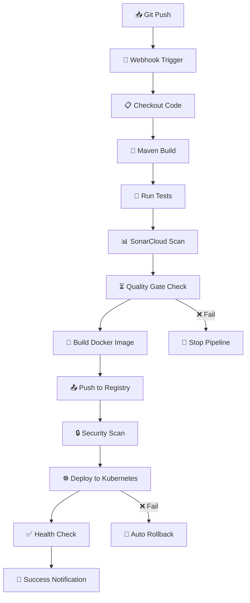

# 🧪 NT548 - Lab 02: Quản lý và triển khai hạ tầng AWS và ứng dụng microservices với Terraform, CloudFormation, GitHub Actions, AWS CodePipeline và Jenkins 

## 👨‍💻 Thông tin sinh viên

* **Họ tên:** \Nguyễn Đặng Bình Minh - 22520871 \Trần Gia Bảo - 22520120
* **Lớp:** NT548 - Công nghệ DevOps và Ứng dụng

---

## 🎯 Mục tiêu bài Lab

* Viết hạ tầng AWS với **Terraform** (Task 1) và **CloudFormation** (Task 2)
* Quản lý trạng thái Terraform bằng S3 + DynamoDB
* Kiểm tra tính hợp lệ Terraform bằng `Checkov`
* Kiểm tra tính hợp lệ CloudFormation với `cfn-lint` và `taskcat`
* Tự động hoá kiểm tra & triển khai bằng GitHub Actions (Task 1) và CodePipeline (Task 2)

---

## ⚙️ Cách chạy mã nguồn

### ✅ Task 1 - Terraform + GitHub Actions
**Lưu ý**: Trước khi thực hiện bài lab. Hãy đảm bảo bạn đã **AWS configure** ACCESS_KEY_ID AND AWS_SECRET_ACCESS_KEY, REGION ĐỂ Có thể triển khai thành công mà không gặp lỗi. Và cung cấp setting Github Repo ACCESS_KEY_ID AND AWS_SECRET_ACCESS_KEY để có thể CI.
* Ở terraform bạn phải tiến hành đổi `ami-id`, `key_pair`, `IP address`, `region`
* Cloudformation cung cấp đúng `key_pair`, `region` `IAM`
-----------------------------
1. Tạo S3 bucket + DynamoDB table dùng cho remote backend - Chạy `terraform init`, `apply` file `terraform-bootstrap.tf`
2. File trạng thái `.tfstate` sẽ lưu ở S3 và khoá bởi DynamoDB sau khi GitHub Actions triển khai CI

CI sẽ chạy tự động khi **push lên branch `main`**:

* Kiểm tra `terraform fmt`, `validate`, `checkov`, `plan`
* Triển khai `terraform apply`
* Sau đó bạn có thể truy cập console của `AWS` để kiểm tra các tài nguyên đã tạo thành công và tiến hành kiểm thử ssh,...

### ✅ Task 2 - CloudFormation + CodePipeline

1. Push các file Task2 vào GitHub repo
2. **Build stage (CodeBuild)**:
   - Chạy `buildspec.yml`
   - Cài `cfn-lint`, `taskcat`
   - Kiểm tra cú pháp file `resource.yaml`
   - Kiểm tra khả năng triển khai qua `taskcat`
   - Sau khi `succeed` thì CodePipeline sẽ tiến hành tự động triển Cloudformation
3. CodePipeline thực hiện:
   * Dùng file `Task2/resource.yaml` 
   * **Deploy:** Dùng CloudFormation để triển khai hạ tầng
   * Sau đó có thể kiểm tra các tài nguyên được tạo ở CloudFormation Stack

---

### ✅ Task 3 - Demo Microservice với Jenkins CI/CD Pipeline

Ứng dụng microservice hoàn chỉnh được xây dựng với Spring Boot, tích hợp Jenkins CI/CD pipeline với SonarCloud, Snyk security scanning và triển khai lên Kubernetes.

## 📋 Tổng quan Task 3

Đây là ứng dụng Spring Boot đơn giản được thiết kế để demo quy trình CI/CD hoàn chỉnh từ phát triển code, build, test, scan bảo mật đến triển khai lên Kubernetes cluster.

### 🏗️ Kiến trúc Task 3

- **Backend**: Spring Boot 2.7.0 với Java 11
- **Build Tool**: Maven 3.8.4
- **Container**: Docker với multi-stage build
- **Orchestration**: Kubernetes
- **CI/CD**: Jenkins Pipeline
- **Code Quality**: SonarCloud
- **Security Scanning**: Snyk
- **Registry**: Docker Hub

## 📁 Cấu trúc dự án Task 3

```
├── src/
│   └── main/java/com/example/demo/
│       ├── DemoApplication.java          # Ứng dụng Spring Boot chính
│       └── controller/
│           └── HelloController.java      # REST API controllers
├── k8s/
│   ├── deployment.yaml                   # Cấu hình Kubernetes deployment
│   └── service.yaml                      # Cấu hình Kubernetes service
├── Dockerfile                            # Cấu hình Docker build multi-stage
├── Jenkinsfile                           # Định nghĩa CI/CD pipeline hoàn chỉnh
├── pom.xml                              # Dependencies Maven project
└── README.md                            # Tài liệu dự án
```

## 🔧 Yêu cầu hệ thống Task 3

### Môi trường Development
- Java 11 hoặc cao hơn
- Maven 3.9.10
- Docker Desktop
- Git
- IDE (IntelliJ IDEA, VS Code, etc.)

### Môi trường CI/CD
- Jenkins server với các plugins cần thiết:
  - Maven Integration Plugin
  - Docker Pipeline Plugin
  - SonarQube Scanner Plugin
  - Snyk Security Plugin
  - Kubernetes CLI Plugin
- Tài khoản SonarCloud và thiết lập project
- Tài khoản Snyk cho quét bảo mật
- Tài khoản Docker Hub cho image registry
- Quyền truy cập Kubernetes cluster

## 🏃‍♂️ Hướng dẫn chạy Task 3 - Jenkins CI/CD Automation

Task 3 tập trung vào việc sử dụng **Jenkins** để tự động hoá toàn bộ quy trình **build, test và deploy** ứng dụng microservice lên Kubernetes cluster.

### Bước 1: Cấu hình Credentials

#### 1.1 Docker Hub credentials
```bash
# Dashboard → Manage Jenkins → Credentials → Global → Add Credentials
Kind: Username with password
Username: <docker-hub-username>
Password: <docker-hub-password>
ID: docker-hub-credentials
Description: Docker Hub Registry Access
```

#### 1.2 Snyk API token
```bash
Kind: Snyk API token
Secret: <snyk-api-token>
ID: snyk-token
Description: Snyk Security Scanner
```

#### 1.3 SonarCloud API token
```bash
Kind: Secret text
Secret: <sonarcloud-api-token>
ID: SONAR_TOKEN
Description: SONARQUBECLOUD TOKEN
```

### Bước 2: Thiết lập Jenkins Server

```bash
# Dashboard → Manage Jenkins → Global Tool Configuration

# Maven:
Name: Maven
Version: 3.9.10 (Install automatically)

# JDK:
Name: JDK11
Version: OpenJDK 11 (Install automatically)

# SonarQube Scanner
Name: SonarQube Scanner
Version: SonarQube Scanner 7.10.0.4889 (Install automatically)

# Snyk
Name: Snyk
Version: latest (Install automatically)

# Dashboard → Manage Jenkins → System Configure

# SonarCloud
Name: SonarCloud
Server URL: https://sonarcloud.io
Server authentication token: SONARQUBECLOUD TOKEN
```

### Bước 3: Tạo và cấu hình Pipeline Job

#### 3.1 Tạo Pipeline job
```bash
# Jenkins Dashboard → New Item
Item name: demo-microservice-pipeline
Type: Pipeline
Click "OK"
```

#### 3.2 Cấu hình Pipeline
```bash
# General:
☑ GitHub project
Project url: https://github.com/<your-repo>/Task3

# Build Triggers:
☑ GitHub hook trigger for GITScm polling

# Pipeline:
Definition: Pipeline script from SCM
SCM: Git
Repository URL: https://github.com/<your-repo>/Task3.git
Branch Specifier: */main
Script Path: Jenkinsfile
```

### Bước 4: Cấu hình GitHub Webhook

```bash
# GitHub Repository → Settings → Webhooks → Add webhook
Payload URL: http://<jenkins-server-ip>:8080/github-webhook/
Content type: application/x-www-form-urlencoded
SSL verification: Disable (nếu dùng HTTP)
Events: ☑ Just the push event
Active: ☑
```

### Bước 5: Trigger và Monitor Pipeline

#### 5.1 Khởi chạy pipeline
```bash
# Có 3 cách trigger:

# 1. Manual trigger
Jenkins Dashboard → demo-microservice-cicd → Build Now

# 2. Git push (tự động) - RECOMMENDED
git add .
git commit -m "Deploy microservice with Jenkins CI/CD"
git push origin main
# → Jenkins sẽ tự động detect và chạy pipeline

# 3. Webhook test
GitHub → Repository → Settings → Webhooks → Recent Deliveries → Redeliver
```

#### 5.2 Theo dõi pipeline execution
```bash
# 1. Jenkins Classic Dashboard
Dashboard → demo-microservice-pipeline → Build History
→ Click build number để xem console output

# 2. Stage View
Build → Pipeline Steps → Click từng stage để xem details
```

### Bước 6: Pipeline Workflow Chi Tiết



### Bước 7: Verification và Monitoring

#### 7.1 Kiểm tra deployment success
```bash
# Sau khi pipeline complete:

# 1. Kiểm tra Jenkins artifacts
Dashboard → Build → Workspace → target/
→ demo-microservice-1.0.0.jar
→ Test reports
→ Coverage reports

# 2. Verify Kubernetes deployment
kubectl get pods -l app=demo-microservice -n jenkins
kubectl get svc demo-microservice-service -n jenkins

# 3. Test application
export NODE_IP=$(kubectl get nodes -o jsonpath='{.items[0].status.addresses[0].address}')
curl http://$NODE_IP:32003/
curl http://$NODE_IP:32003/health

# 4. Check reports
SonarCloud Dashboard: https://sonarcloud.io
Snyk Dashboard: https://app.snyk.io
Docker Hub: https://hub.docker.com/r/<username>/demo-app
```

## 📊 API Task 3

| Method | Endpoint | Mô tả | Định dạng Response |
|--------|----------|-------|-------------------|
| GET | `/` | Endpoint chính của ứng dụng | JSON với message, version, và timestamp |
| GET | `/health` | Trạng thái health của ứng dụng | JSON với status và thông tin service |

### Ví dụ Response API

**GET /**
```json
{
  "message": "Hello from Microservice! New message here hihi!",
  "version": "1.0.0",
  "timestamp": "1640995200000"
}
```

**GET /health**
```json
{
  "status": "UP",
  "service": "demo-microservice"
}
```

## 🔄 Jenkins CI/CD Pipeline Task 3

Jenkins pipeline bao gồm các giai đoạn tự động hoá sau:

### 1. **Checkout** 📥
- Lấy source code từ GitHub repository
- Xác minh thiết lập workspace và tính khả dụng của file

### 2. **Build** 🔨
- Thực thi Maven clean compile
- Kiểm tra build artifacts và dependencies

### 3. **Test** 🧪
- Chạy bộ unit test toàn diện với Maven
- Tạo báo cáo test chi tiết
- Publish kết quả JUnit test để theo dõi

### 4. **SonarCloud Analysis** 🔍
- Thực hiện phân tích static code cho các chỉ số chất lượng
- Đánh giá technical debt và độ bao phủ code
- Tạo báo cáo chất lượng toàn diện

### 5. **Quality Gate** ⏳
- Chờ đánh giá SonarCloud quality gate
- Tự động fail pipeline nếu tiêu chuẩn chất lượng không đạt
- Đảm bảo chất lượng code trước khi tiến hành triển khai

### 6. **Build & Push Docker Image** 🐳
- Build Docker image tối ưu sử dụng phương pháp multi-stage
- Gắn tag image với build number và latest tag
- Push images lên Docker Hub registry

### 7. **Security Scan** 🔒
- Thực hiện quét lỗ hổng Snyk trên dependencies
- Xác định các rủi ro bảo mật tiềm ẩn và lỗ hổng
- Tạo báo cáo đánh giá bảo mật

### 8. **Deploy to Kubernetes** ☸️
- Cập nhật Kubernetes deployment với phiên bản image mới
- Áp dụng các file cấu hình đã cập nhật
- Theo dõi trạng thái rollout và thực hiện health checks
- Triển khai rollback tự động khi triển khai thất bại

---

## 🔍 Cách kiểm tra kết quả triển khai

### Task 1

* Vào **EC2 > Instances**:

  * EC2 Public có thể SSH được (qua IP public)
  * EC2 Private không có IP public, chỉ SSH từ EC2 Public
* Vào **VPC > Route Tables & Subnets**:

  * Subnet private route qua NAT Gateway
  * Subnet public gắn với IGW

### Task 2

* Vào **CloudFormation > Stacks**:

  * Tên stack: `NT548-Lab2`
  * Trạng thái: `CREATE_COMPLETE`
* Kiểm tra tương tự phần trên với EC2/VPC

### Task 3 - Microservice Jenkins Pipeline

* **Jenkins Dashboard**: Kiểm tra trạng thái build và thực thi pipeline
* **SonarCloud**: Xem các metrics chất lượng code và báo cáo coverage
* **Snyk Dashboard**: Kiểm tra các lỗ hổng bảo mật
* **Docker Hub**: Xác minh image được push thành công
* **Kubernetes Cluster**:
  ```bash
  kubectl get pods -l app=demo-microservice
  kubectl get svc demo-microservice-service
  curl http://<node-ip>:32003/health
  ```

---

## 💰 Chi phí & lưu ý

* **EC2 và NAT Gateway** có thể phát sinh chi phí
* Sau khi chạy xong, hãy **xoá CloudFormation stack và tài nguyên Terraform**

---

## 🧠 Ghi chú kỹ thuật

* Task 1:

  * Dùng Terraform module hoá các thành phần hạ tầng
  * Quản lý backend bằng S3 + DynamoDB
  * CI/CD bằng GitHub Actions
* Task 2:

  * Viết template CloudFormation thuần YAML
  * Kiểm tra template bằng `taskcat`
  * Quản lý backend bằng S3
  * Tích hợp CI/CD với AWS CodePipeline

* **Task 3**:
  * Spring Boot microservice với CI/CD toàn diện
  * Jenkins Pipeline với nhiều quality gates
  * Docker containerization và Kubernetes deployment
  * Quét bảo mật và phân tích chất lượng code
  * Triển khai tự động với khả năng rollback  


